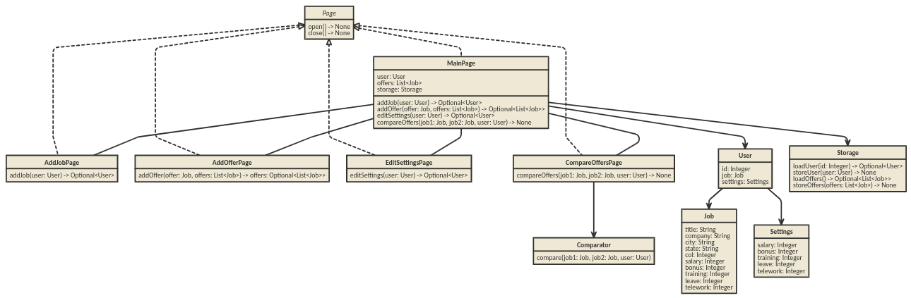
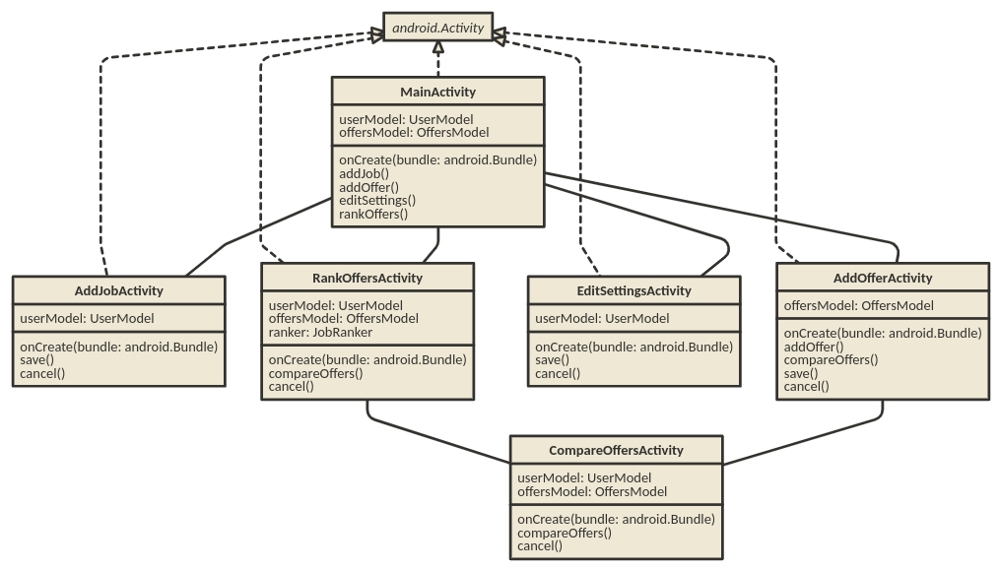
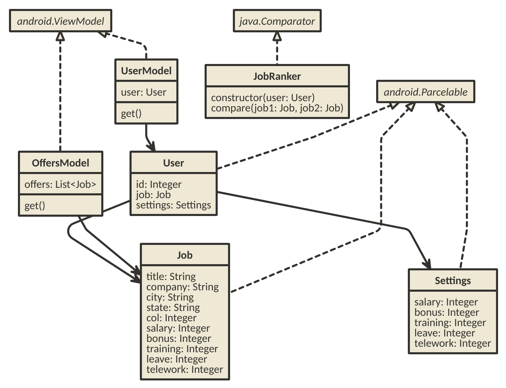

# Team 032 - CS6300 Summer 2024 - Design Discussion

## Design 1 - mzhao341

## Design 2 - pwang422

## Design 3 - ssinha96
The design document that I made was for an application that would have been extensible and scalable.
However, for the purposes of the group project, which will be written in Android, I don't think my approach would work.

That said, I do think that my generalization of a job, rather than having separate ways of storing a current job and an offered job is elegant.

The design document that I made was for an application that would have been extensible and scalable. However, for the purposes of the group project, which will be written in Android, I don't think my approach would work. That said, I do think that my generalization of a job, rather than having separate ways of storing a current job and an offered job is elegant.

## Design 4 - tsachse3

My original design was somewhat adapted to building an Android app but had some flaws and gaps that needed to be fleshed out. Android has several unique quirks that break some OOP concepts and my design did not account for those quirks. Otherwise my design maps pretty well to the requirements and had an acceptable amount of detail.

## Team Design

Our proposed design is inspired by a little bit of everyone's individual work. It provides a separate page (Android activity) for each key feature and includes a succinct data model that treats offers and the current job as instances of the same class. It is also adapted to Android specifically by inheriting from Android's `Activity` class and by using `ViewModels` for persistent state storage.

## Summary

During our discussion we learned that each individual has certain strengths and it's important to play into teammates' strengths. We also explored compromising and synthesizing ideas into a single cohesive plan. We found that key assumptions about the software or the software's environment can change, leading to new challenges that must be solved. This means it's important to balance detail and speed early in the design process to remain flexible and adaptable.
