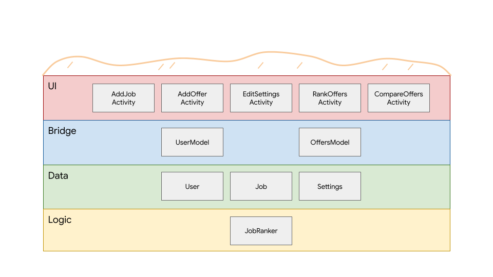
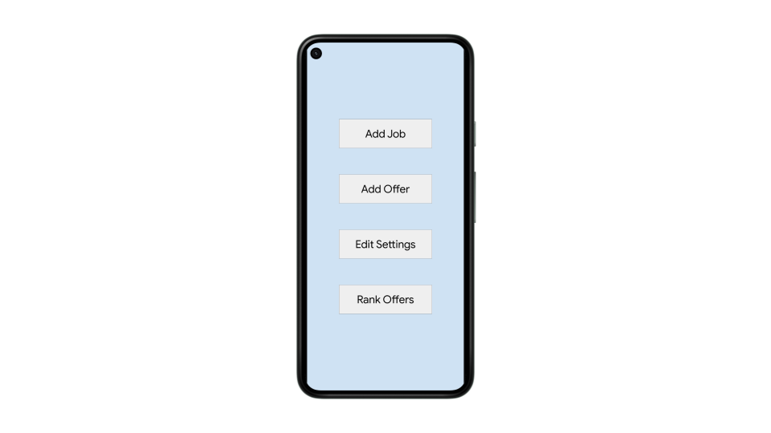
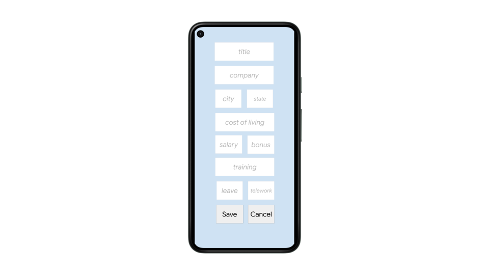
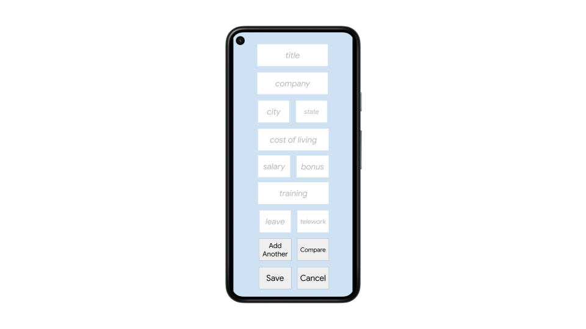
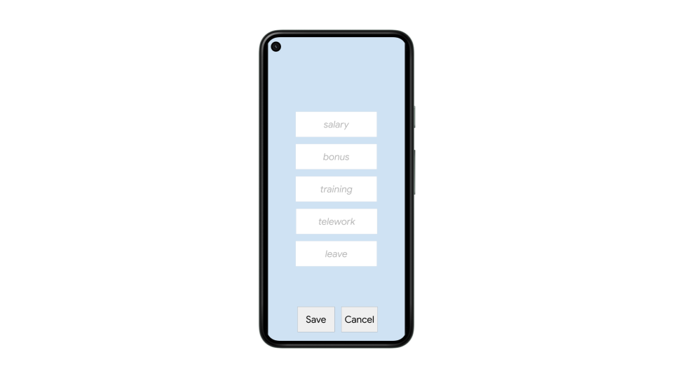
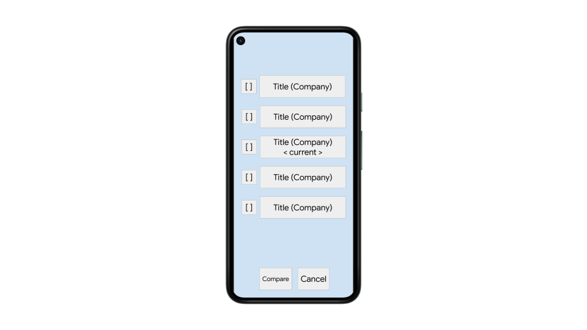
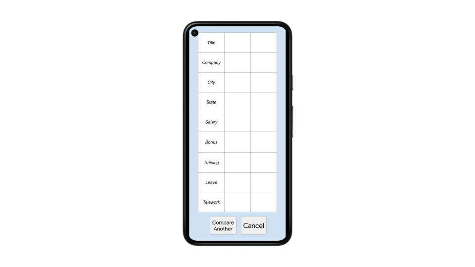

# Design Document

**Author**: Team032

## 1 Design Considerations

This section discusses various design considerations for a new app called `JobCompare`.

### 1.1 Assumptions

This design assumes that:

* the user is an English speaker
* the user has a reasonably modern Android phone that can install apps
* the user has some familiarity with Android apps in general

### 1.2 Constraints

This design must:

* not call backend services or use the network at all
* only support a single user

### 1.3 System Environment

This design produces an app that runs on modern Android phones. It relies on the Android Framework for UI and hardware support.

## 2 Architectural Design

This section describes the high-level architecture of `JobCompare`.

### 2.1 Component Diagram

The app supports four key features:

* allow the user to add details about her current job
* allow the user to add multiple potential job offers into a list
* allow the user to compare job offers
* allow the user to adjust comparison parameters for various job attributes

These features map directly to `Activities`, the primary UI container in the Android Framework that represents a "page" or "screen". These activities make up the first component of the app: the UI layer.

The app contains two middle layers that represent the app's state: the Bridge layer and the Data layer. The Data layer contains the app's state data classes. The Bridge layer provides persistent access to instances of the data (via Android `ViewModels` since data does not persist reliably within activities directly). The final layer is the Logic layer, which contains a `JobRanker` used to rank job offers. More details on these classes are provided in the following sections.

This diagram shows how the different components relate:


### 2.2 Deployment Diagram

This app is installed directly by users and does not need to be deployed in any way.

## 3 Low-Level Design

This section describes the low-level architecture of `JobCompare`.

### 3.1 Class Diagrams

There are three data classes that the app is concerned with: the `User`, the `Job`, and the `Settings`. A `User` instance contains details about the current user, including her current job (`Job`) and comparison settings (`Settings`). A `Job` instance contains attributes for a job or job offer like `title`, `company`, `salary`, and other attributes. A `Settings` instance contains weights that represent how important different job attributes are to the user. These weights are used when a user compares two jobs. 

Android activities have a complicated lifecycle and can effectively be destroyed by the system at any time to free up memory. This means that activities should not directly hold any state (such as an instance of `User` or a list of `Job` offers). Android apps that maintain working mutable state generally use Android `ViewModels` to store that state. A `ViewModel` acts like a bridge between the emphemeral Android activities and persistent, in-memory state for the app. `ViewModels` have separate lifecycles from activities and can be easily accessed by all activities within an app.

This app uses two `ViewModels`: a `UserModel` for the current user and an `OffersModel` for the list of available job offers. These models are accessible from all activities. All data classes also implement Android's `Parcelable` interface to further facilitate moving data between activities.

The Logic layer contains business logic for ranking jobs based on a user's preferences. The `RankOffersActivity` must sort the offers within the `OffersModel` instance before displaying them. This sorting is done with a custom implementation of a Java `Comparator` class: the `JobRanker` class. This class contains a single method: `compare(job1 Job, job2 Job)`. The method returns a negative number if `job1` is "better" than `job2`, a positive number if `job2` is "better" than `job1`, and zero if the jobs are equal. This comparator can be used to sort the offers like this:

```java
var user = userModel.get();
var offers = offersModel.get();
Collections.sort(offers, new JobRanker(user));
```

This diagram shows how the classes map into the layered component architecture described earlier:



This diagram shows the shape of the classes within the UI component and how they interact in this design:


This diagram shows the shape of the classes within the Bridge, Data, and Logic components and how they interact in this design:


## 4 User Interface Design

The following (rough) mockups show the layout of each activity in the app's UI. These mockups are meant more as a technical guide and don't represent the final look-and-feel of the app.

This mockup shows the UI of the `MainActivity`:



This mockup shows the UI of the `AddJobActivity`:



This mockup shows the UI of the `AddOfferActivity`:



This mockup shows the UI of the `EditSettingsActivity`:



This mockup shows the UI of the `RankOffersActivity`:



This mockup shows the UI of the `CompareOffersActivity`:


